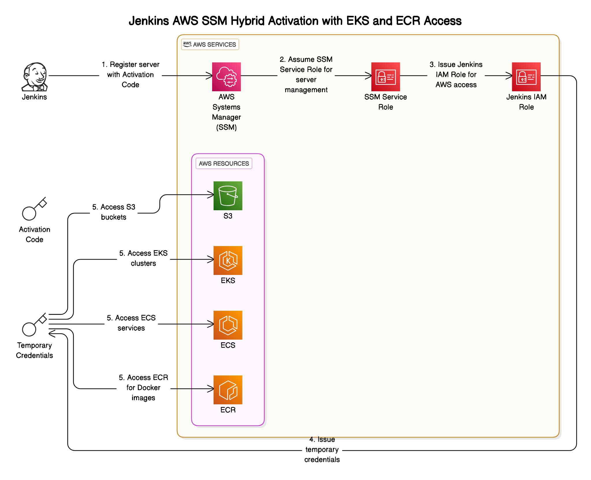

# Jenkins AWS SSM Hybrid Activation with AWS Resources

This repository provides a secure integration solution for on-premises Jenkins servers to access AWS resources without hardcoded credentials. Using AWS Systems Manager (SSM) hybrid activations, Jenkins can assume an AWS IAM role to interact with services like S3, ECR, and EKS, enabling a secure and automated CI/CD environment.

## Architecture Diagram



## Overview

For teams running Jenkins on-premises, this solution enables AWS role access without the need for embedded credentials. The setup relies on:

1. **SSM Hybrid Activation** - Secure registration of on-premises servers with AWS Systems Manager.
2. **IAM Roles for Jenkins** - Permissions for AWS services access (S3, ECR, EKS) through role assumption.
3. **Lambda-Based Activation Management** - Automated SSM activation creation and management for seamless server registration.

## Prerequisites

- AWS CLI access for stack deployment
- Permissions to create IAM roles and CloudFormation stacks
- Jenkins server access to execute setup scripts

## Setup Instructions

### Step 1: Deploy CloudFormation Stack

1. Deploy the CloudFormation stack using the provided `jenkins-aws-ssm-hybrid-activation.yaml` template.
2. After deployment, note the **ActivationId** and **ActivationCode** from the stack outputs. These will be used for server registration.

### Step 2: Configure Jenkins Server(s)

Run the shell script (`install-ssm.sh`) on each Jenkins server to:

- Install or update the AWS CLI.
- Detect Linux distribution and install SSM Agent according to system architecture.
- Register the server with AWS SSM using the ActivationId and ActivationCode.

To execute the script:

```bash
bash install-ssm.sh
```

The script will prompt for **AWS Region**, **ActivationId**, and **ActivationCode**.

### Step 3: Configure CI/CD Pipelines

Configure Jenkins pipelines to assume the `JenkinsAccessRole` to securely interact with AWS resources, leveraging SSM and IAM without hardcoded credentials.

### Key CloudFormation Components

- **SSM Service Role**: Enables secure hybrid activation for Jenkins through AWS SSM.
- **Jenkins Role**: Provides permissions for accessing S3, ECR, and EKS.
- **Lambda Function**: Automates SSM activation creation, ensuring temporary access and secure server registration.

### Outputs

The stack outputs the following values:

- **SSMServiceRoleArn**: ARN for SSM Service Role.
- **JenkinsRoleArn**: ARN for Jenkins IAM Role.
- **ActivationId** and **ActivationCode**: Used for secure SSM registration of on-premises servers.
- **RegistrationLimit**: Defines the maximum number of servers for activation.

### Important Notes

- **Credential-Free Access**: This solution eliminates the need for hardcoded AWS credentials, enhancing security by using AWS Systems Manager for role assumption.
- **Automatic Credential Rotation**: Unlike traditional access keys that need manual rotation every 90 days, this setup allows for customizable key rotation intervals. By configuring the **KeyAutoRotateDays** setting, you can set how frequently credentials are rotated (e.g., every 1 day or every 7 days) based on your security requirements.
- **Permissions Management**: Ensure the `JenkinsAccessRole` permissions are aligned with the specific needs of your pipelines, following the principle of least privilege.
- **Automated Key Rotation**: The setup enables auto-rotation of private keys, further securing Jenkins server access to AWS.


## FAQ

### How does this setup differ from the Jenkins Pipeline AWS Plugin?

This setup differs in security, credential management, and intended use cases. While the Jenkins Pipeline AWS Plugin is often convenient for AWS-hosted Jenkins instances, this repository’s SSM Hybrid Activation method is better suited for securely managing on-premises Jenkins servers that require AWS access.

---

### Which option is more secure for an on-premises Jenkins server?

**This repository’s SSM Hybrid Activation setup is generally more secure for on-premises Jenkins servers** because it avoids static credentials entirely. By leveraging AWS Systems Manager (SSM) for hybrid activation, credentials are dynamically issued by AWS through role assumption, reducing the risk of exposure and eliminating the need for manual key rotation.

---

### Do both options support temporary credential rotation?

Yes, both options can use temporary credentials, but they differ in how they’re managed:

- **SSM Hybrid Activation (this repository)**: Credentials are automatically rotated by AWS without user intervention. This approach avoids static access keys and issues fresh credentials every session, with AWS handling all expiration and renewal through Systems Manager.
  
- **Jenkins Pipeline AWS Plugin**: While it can assume roles to obtain temporary credentials, it commonly relies on static credentials (access keys) for on-premises Jenkins servers. Without additional setup, these credentials need manual rotation.

---

### Which option is easier to set up?

- **Jenkins Pipeline AWS Plugin** is generally easier to set up, especially for Jenkins instances within AWS, as it only requires installing the plugin and providing access credentials (either static keys or role-based).
  
- **SSM Hybrid Activation (this repository)** requires a more comprehensive setup, including a CloudFormation stack deployment and the installation of SSM Agent on the Jenkins server. However, this initial setup offers a more secure, managed environment with automated credential handling.

---

### Can this repository's setup be used with Jenkins Pipeline scripts?

Yes, the Jenkins server set up with SSM Hybrid Activation can interact with AWS services directly in pipeline scripts, just as it would with the Jenkins Pipeline AWS Plugin. Once the Jenkins server is registered and has the necessary IAM role (`JenkinsAccessRole`), it can securely access AWS resources and use AWS CLI commands in scripts without hardcoded credentials.

---

### Does either option support automatic key rotation for the SSM Agent?

- **SSM Hybrid Activation (this repository)**: Includes configuration for automatic key rotation within the SSM Agent by setting `KeyAutoRotateDays`. This provides daily key rotation, which adds security to the agent’s encrypted communications.

- **Jenkins Pipeline AWS Plugin**: Does not manage key rotation for the SSM Agent. Users would need to set up any encryption or key management practices separately if required.

---

### Which option is best for a Jenkins instance hosted within AWS?

For Jenkins servers within AWS, the **Jenkins Pipeline AWS Plugin** may be more convenient, as it allows seamless integration with IAM roles and requires minimal setup. The plugin can assume roles within AWS environments without needing hybrid activation, and it supports AWS CLI commands directly in pipeline scripts.

---

### When should I use this repository over the Jenkins Pipeline AWS Plugin?

Use **this repository’s SSM Hybrid Activation setup** if:

- Your Jenkins server is hosted on-premises or outside AWS, and you need secure AWS access without static credentials.
- You want AWS to handle all credential rotation, expiration, and renewal automatically.
- You require a setup with no hardcoded credentials, leveraging IAM roles and SSM’s secure connection.

The **Jenkins Pipeline AWS Plugin** is a good choice if:

- Your Jenkins server is hosted within AWS.
- You need a quick and easy way to execute AWS CLI commands within Jenkins Pipeline scripts.
- You have secure access management already in place, especially if using static credentials in on-premises setups.

